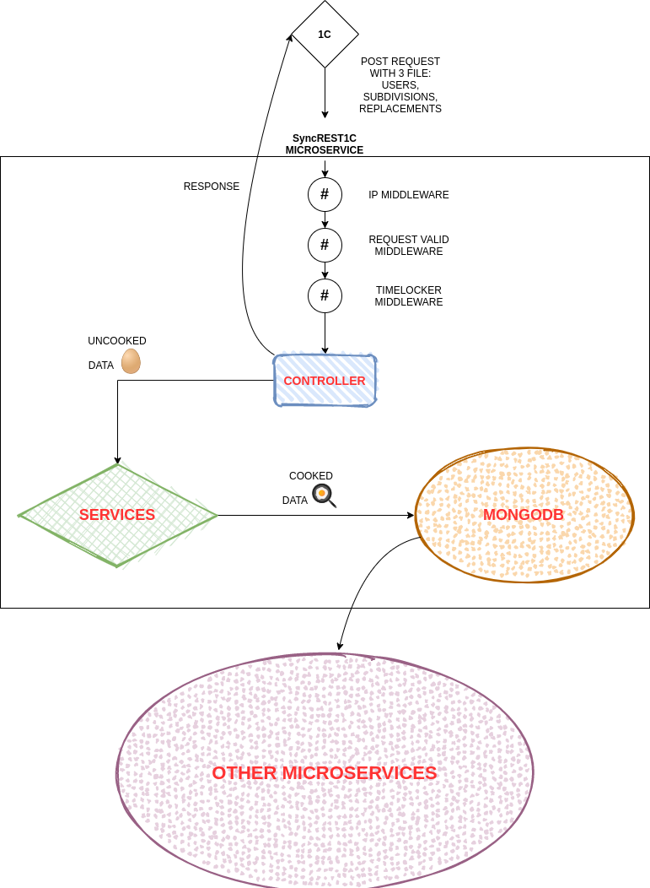

# SyncRest1C

## Микросервис для получения данных из 1С

### Схема работы микросервиса:


### Документация: 
Swagger - документация доступна по - `/api-docs`

1. `npm run idx` - Для создания коллекций.
2. `npm run add 213.123.123.123` - Для добавления IP в список разрешенных.
3. `npm run start` - Для запуска сервиса.

Для удаления из списка разрешенных IP - `npm run delete 213.123.123.123`.

Для запуска сервиса с монгой в режиме репликации:
1. Закомментировать в файле settings.js - 9 и 10 строку.
2. Расскоментировать 12, 13, 14, 15 строки.

### .env:

1. Перед запуском переименовать файл .env.example в .env и заполнить необходимыми параметрами.

`CLEAN_STORAGE_DAY` - Параметр для очистки данных в JSON/data, если установлен 10, то файлы которые созданы 10 дней назад удалятся. (По умолчанию - 14)

`TIMELOCK` - Время в секундах, для блокировки последующих запросов. (По умолчанию - 3600). Устанавливается один раз, во время запуска - `npm run idx`

### Создание кастомных ролей в MongoDB:

На примере кастомных ролей сервиса fail2ban:
```javascript
use admin
db.createRole({
  role: "AuthAppRole",
  privileges: [
    {
      resource: { db: "fail2ban", collection: "ban" },
      actions: [ "insert" ]
    }
  ],
  roles: [
    { role: "readWrite", db: "Auth" },
    { role: "dbAdmin", db: "Auth" }
  ]
})
```

role stored in admin database

### Изменение роли у пользователя в MongoDB:
user stored in Auth database
```javascript
use Auth
db.updateUser("ans1",{
    roles:[{role:'AuthAppRole',db:'admin'}]
})
```
